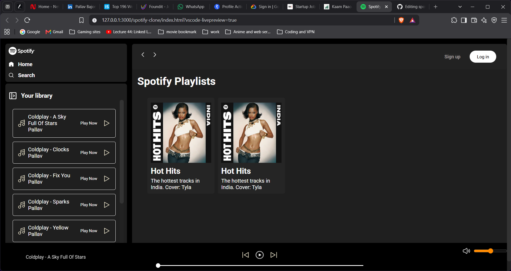
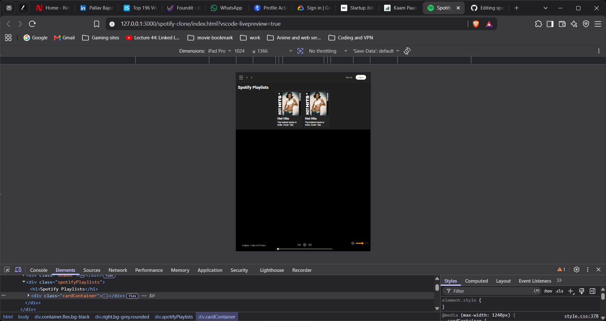
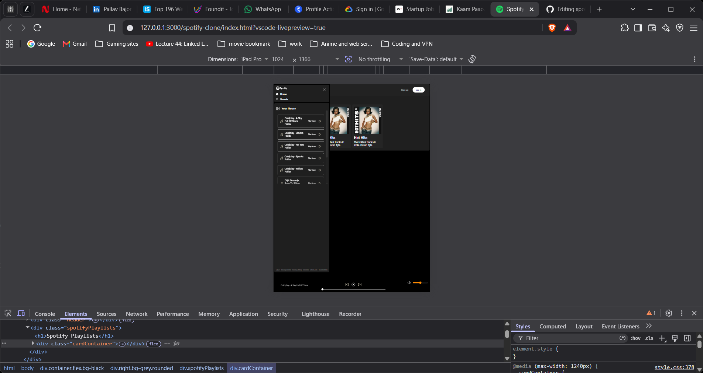
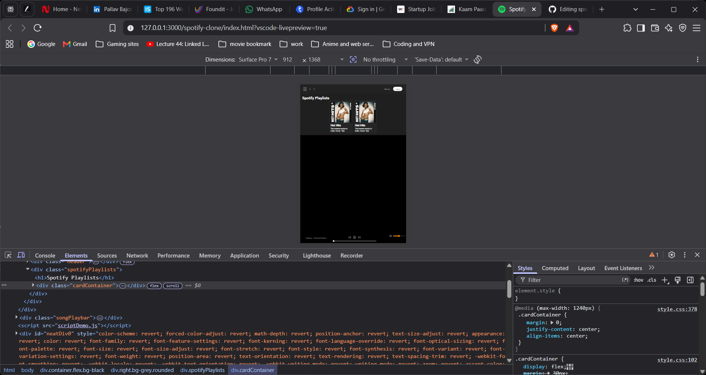

# 🎵 Spotify Clone — Web Music Player

A Spotify-inspired web music player built using HTML, CSS, and JavaScript.

This project was created as a personal web development project to practice frontend development, JavaScript, DOM manipulation, responsive design, and building an interactive music player.

## 📸 Preview

## ✨ Features

- ▶️ Play and pause songs
- ⏭️ Next and previous song controls
- 🔄 Automatically plays the next song
- 🎵 Displays the currently playing song
- ⏱️ Song duration and current playback time
- 🎚️ Interactive seekbar
- 🔊 Volume control
- 🔇 Mute / unmute functionality
- 📱 Responsive layout for tablets and iPads
- 🖥️ Optimized desktop layout
- 📂 Song library
- 🎨 Spotify-inspired user interface

## 🛠️ Technologies Used

- HTML5
- CSS3
- JavaScript
- HTML Audio API
- Responsive Web Design

## 📐 Responsive Design

The project is optimized for:

- 🖥️ Desktop
- 📱 Tablets
- 📱 iPads

The layout adapts to different screen sizes while maintaining the music player experience.

## 🖼️ Screenshots

### iPad

### Tablet

## 🚀 How to Run
